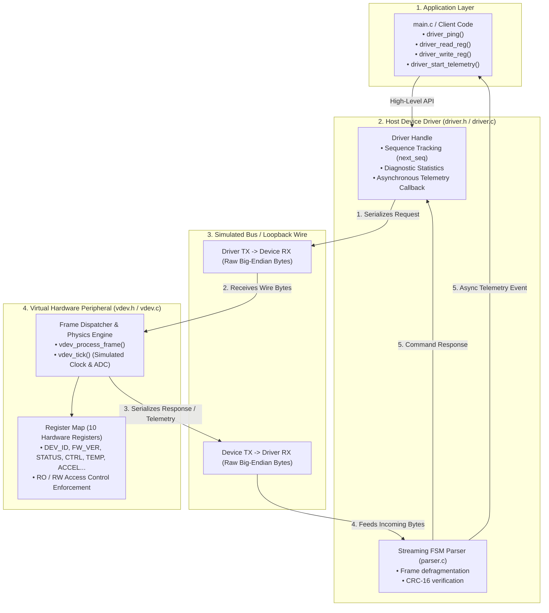

# Virtual Device Driver & Binary Protocol Engine

[]()
[]()
[]()
[]()

A production-grade **Systems Software Engineering** project in C implementing a custom binary wire protocol, table-driven CRC-16 engine, resilient streaming Finite State Machine (FSM) parser, virtual hardware peripheral emulator with memory-mapped registers, and a host device driver supporting synchronous transactions and asynchronous telemetry streaming.

---

## System Architecture



---

## Key Systems Engineering Highlights

- **Strict Hardware Boundary Encapsulation**: The driver never accesses the virtual device's memory directly. All transactions travel across an explicit serialized byte stream with CRC-16 validation.
- **Zero Dynamic Allocations**: Bounded stack and static memory usage throughout the wire protocol and parser—zero `malloc` overhead, zero heap fragmentation risks, and deterministic embedded runtime behavior.
- **Network Byte Order (Big-Endian)**: Endian-safe wire serialization using explicit bit-shifts, guaranteeing seamless interoperability across x86_64, ARM64, and embedded microcontrollers.
- **Resilient Streaming FSM Parser**: Single-byte streaming consumer that handles 1-byte packet fragmentation, multi-packet coalescence, and automatic resynchronization through corrupted line noise.
- **High-Performance CRC-16-CCITT Engine**: Precomputed 256-entry lookup table for the polynomial $x^{16} + x^{12} + x^5 + 1$ (`0x1021`, init `0xFFFF`), verified with the standard `"123456789"` $\rightarrow$ `0x29B1` test vector.
- **Memory Safety & Sanitizers**: 100% clean under AddressSanitizer (`-fsanitize=address`) and UndefinedBehaviorSanitizer (`-fsanitize=undefined`) with zero memory leaks, zero buffer overflows, and zero compiler warnings under `-Wall -Wextra -Werror -pedantic`.

---

## Wire Protocol Specification

Every packet transmitted over the physical bus follows this compact, aligned frame structure:

```text
 0                   1                   2                   3
 0 1 2 3 4 5 6 7 8 9 0 1 2 3 4 5 6 7 8 9 0 1 2 3 4 5 6 7 8 9 0 1
+-+-+-+-+-+-+-+-+-+-+-+-+-+-+-+-+-+-+-+-+-+-+-+-+-+-+-+-+-+-+-+-+
|          MAGIC (0xAA55)       |    SEQ NUM    |  OPCODE/CMD   |
+-+-+-+-+-+-+-+-+-+-+-+-+-+-+-+-+-+-+-+-+-+-+-+-+-+-+-+-+-+-+-+-+
|       PAYLOAD LENGTH (16-bit) |      PAYLOAD BYTES (...)      |
+-+-+-+-+-+-+-+-+-+-+-+-+-+-+-+-+-+-+-+-+-+-+-+-+-+-+-+-+-+-+-+-+
|          PAYLOAD BYTES (...)                  |    CRC-16     |
+-+-+-+-+-+-+-+-+-+-+-+-+-+-+-+-+-+-+-+-+-+-+-+-+-+-+-+-+-+-+-+-+
```

| Field | Size | Description |
| :--- | :--- | :--- |
| **Sync Word** | 2 Bytes | Magic marker `0xAA55` identifying frame boundaries in raw streams |
| **Sequence Number** | 1 Byte | Rolling packet counter to detect lost or out-of-order packets |
| **Opcode** | 1 Byte | Command / Response type (`OP_PING`, `OP_READ_REG`, `OP_WRITE_REG`, etc.) |
| **Payload Length** | 2 Bytes | Big-Endian byte count of variable payload ($0 \le N \le 256$) |
| **Payload** | $N$ Bytes | Command arguments, register values, or sensor telemetry bytes |
| **CRC-16** | 2 Bytes | CRC-16-CCITT checksum computed over Header + Payload |

---

## Virtual Peripheral Register Map

The peripheral emulates a 16-bit register map with hardware boundary checking and read-only protection:

| Address | Name | Access | Default Value | Description |
| :---: | :--- | :---: | :---: | :--- |
| `0x00` | `REG_DEV_ID` | RO | `0xCAFE` | Unique peripheral hardware identifier |
| `0x01` | `REG_FW_VER` | RO | `0x0100` | Firmware version (v1.0) |
| `0x02` | `REG_STATUS` | RO | `0x0001` | Bitflags: `READY` (0), `BUSY` (1), `STREAMING` (2), `ERROR` (3) |
| `0x03` | `REG_CTRL` | RW | `0x0000` | Bitflags: `ENABLE` (0), `RESET` (1), `STREAM_ON` (2) |
| `0x04` | `REG_SAMPLE_RATE` | RW | `10` | Telemetry sampling rate (Hz) |
| `0x05` | `REG_TEMP` | RO | `250` | Calibrated temperature in tenths of °C (250 = 25.0°C) |
| `0x06` | `REG_ACCEL_X` | RO | `0` | Accelerometer X-axis in signed milli-g |
| `0x07` | `REG_ACCEL_Y` | RO | `0` | Accelerometer Y-axis in signed milli-g |
| `0x08` | `REG_ACCEL_Z` | RO | `1000` | Accelerometer Z-axis in signed milli-g (~1.0g gravity) |
| `0x09` | `REG_SCRATCHPAD` | RW | `0x0000` | General-purpose read/write scratchpad register |

---

## Quickstart: Build & Run

### 1. Run All Unit Test Suites
```bash
make test
```
Executes all 4 unit test suites under AddressSanitizer and UndefinedBehaviorSanitizer:
- **Suite 1 (`test_protocol`)**: CRC-16 correctness, serialization roundtrips, MTU bounds, bit-flip detection.
- **Suite 2 (`test_streaming`)**: 1-byte fragmentation, irregular chunk feeding, packet coalescence, line noise recovery.
- **Suite 3 (`test_vdev`)**: Register boundary checks, read-only permissions, soft-reset via `REG_CTRL`, telemetry generation.
- **Suite 4 (`test_driver`)**: Ping transactions, register reads/writes, NACK error mapping, async telemetry callback handling.

### 2. Run the Live Simulation
```bash
make sim
```
Runs the interactive live demo showcasing hardware link verification, register map inspection, read-only protection enforcement, live sensor telemetry streaming, and driver diagnostics.

---

## Project Structure

```text
09-virtual-device-driver/
├── Makefile                # Strict C11 build configuration with ASan & UBSan
├── README.md               # Enterprise architecture & protocol documentation
├── include/
│   ├── protocol.h          # Binary frame layout, opcodes, error status codes
│   ├── crc16.h             # Table-driven CRC-16-CCITT engine interface
│   ├── parser.h            # Streaming FSM parser & error statistics definitions
│   ├── vdev.h              # Virtual hardware registers & peripheral state
│   └── driver.h            # Host device driver APIs & asynchronous callback
├── src/
│   ├── crc16.c             # 256-entry precomputed CRC-16 lookup table implementation
│   ├── protocol.c          # Safe Big-Endian frame packing & unpacking
│   ├── parser.c            # Resilient byte-by-byte streaming FSM parser
│   ├── vdev.c              # Virtual hardware emulator, register map & physics clock
│   ├── driver.c            # Host driver loopback engine & telemetry demultiplexer
│   └── main.c              # Live terminal simulation application
└── tests/
    ├── test_protocol.c     # Phase 1: Protocol & CRC-16 test suite
    ├── test_streaming.c    # Phase 2: Resilient parser stress test suite
    ├── test_vdev.c         # Phase 3: Hardware peripheral unit test suite
    └── test_driver.c       # Phase 4: Host device driver unit test suite
```
